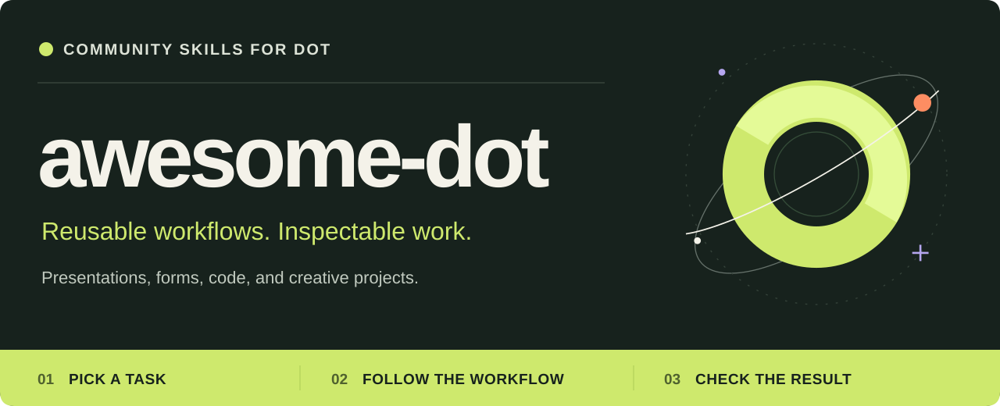

<picture>
  <source media="(max-width: 600px)" srcset=".github/assets/landing-hero-mobile.svg">
  
</picture>

  <a href="#use-it-with-dot"><strong>Use a workflow</strong></a> ·
  <a href="skill/budget-variance-waterfall/WORKED-EXAMPLE.md">See a worked example</a> ·
  <a href="CONTRIBUTING.md">Contribute</a>

Practical skills for dot. Each workflow explains what to gather, the steps to follow, decisions that need your input, and how to check the result. The instructions, examples and supporting files live together in each skill's folder.

## Start with something you need done

- **Understand a spending change.** Turn planned and actual amounts into category differences, a waterfall chart and reconciled totals. [Follow the workflow →](skill/budget-variance-waterfall/SKILL.md)
- **Make a bug report testable.** Turn a vague report into precise reproduction steps, expected results and an evidence log. [Follow the workflow →](skill/bug-reproduction-triage/SKILL.md)
- **Prepare a change for review.** Turn a diff and its test evidence into a focused handoff with a reading order and open questions. [Follow the workflow →](skill/code-review-handoff/SKILL.md)

## Use it with dot

1. Open a workflow above and give dot its link or paste its contents.
2. Add your task, relevant files and any limits on what dot may do.
3. Ask for the workflow's deliverables and checks, including anything that remains unverified.

For the spending example: “Use this workflow with my attached budget and actual totals. Explain the category changes, reconcile the totals and flag anything you can't classify.”

The guides distinguish completed work from unverified steps. Available tools, account access and required approvals determine what can run. Reading a skill does not install it or grant access.

[Contributing](CONTRIBUTING.md) · [MIT License](LICENSE)

Community-maintained; not an official OpenAI project.
