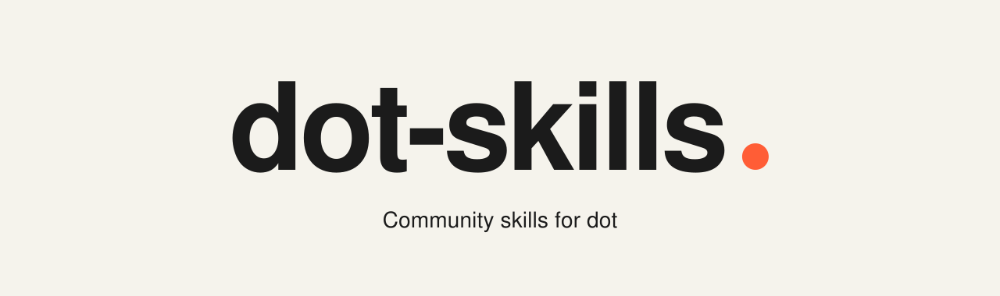
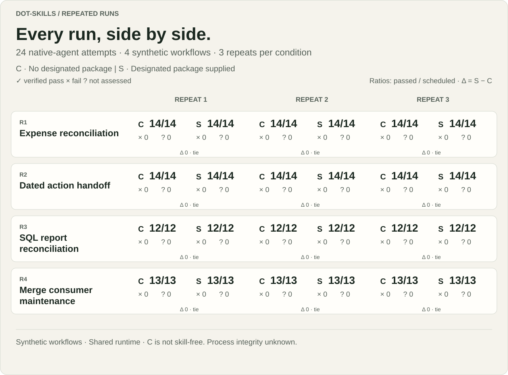
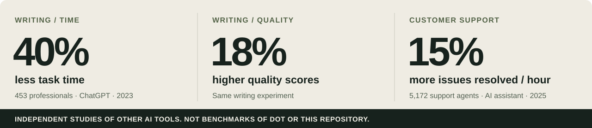

<picture>
  <source media="(max-width: 600px)" srcset=".github/assets/landing-hero-mobile-v3.svg">
  
</picture>

  <a href="#use-it-with-dot"><strong>Use a skill</strong></a> ·
  <a href="#what-this-repository-measured">See the evaluation</a> ·
  <a href="#what-ai-research-has-measured">Read the research</a> ·
  <a href="CONTRIBUTING.md">Contribute</a>

**Reusable Markdown workflows for dot.** Each skill brings together the inputs, steps, examples, and checks for a concrete task. Give dot a skill and your materials, then review the work it produces.

**Describe your task and let dot choose the workflow.** [Start with the task router →](skill/task-to-skill-router/SKILL.md) It checks the available skills, chooses the smallest suitable route, and proceeds with the work you authorized.

Try: “Use the task router for this task: [describe the result you need]. I have [files or context]. Choose the right workflow, ask only for what matters, and carry it out within these limits: [constraints].”

## Pick your next task

- **Explain a spending change.** Compare plan versus actual, handle refunds, and reconcile the totals. The [worked example](skill/budget-variance-waterfall/WORKED-EXAMPLE.md) shows why a flat total can hide category changes. [Use the skill →](skill/budget-variance-waterfall/SKILL.md)
- **Make a bug report testable.** Turn a vague symptom into reproduction steps, expected behavior, and an evidence log. [Use the skill →](skill/bug-reproduction-triage/SKILL.md) · [Prepare the review handoff →](skill/code-review-handoff/SKILL.md)
- **Plan errands around real constraints.** Account for opening windows, fixed appointments, travel, and buffers; show when the plan is too tight. [Use the skill →](skill/errand-window-plan/SKILL.md)
- **Build a playable orbital lab.** Follow a method for deterministic physics, solvable missions, and numerical checks. This is a build guide, not a hosted game. [Use the skill →](skill/orbital-game-lab/SKILL.md)
- **Investigate, build, and verify engineering work.** Use dot-stack to choose a focused workflow, preserve existing work, and report evidence and limits. [Use the skill →](skill/dot-stack/SKILL.md)

[Browse all skill folders →](skill/)

## What this repository measured

**Follow the work, from source packet to reviewable output.** We ran four synthetic workflows three times per condition: reconcile expenses, untangle dated action items, check a SQL report, and maintain a merge/persistence component.

<picture>
  <source media="(max-width: 600px)" srcset=".github/assets/repeated-stress-evidence-mobile.svg">
  
</picture>

Inspect the fields: expense [totals](evaluation/studies/repeated-stress-2026-10-06/artifacts/T07-R1-r3-C/reconciliation.json#L590-L604) / [duplicate](evaluation/studies/repeated-stress-2026-10-06/artifacts/T07-R1-r3-C/reconciliation.json#L117-L134) / [unvalued hold](evaluation/studies/repeated-stress-2026-10-06/artifacts/T07-R1-r3-C/reconciliation.json#L493-L510) / [paired S](evaluation/studies/repeated-stress-2026-10-06/artifacts/T08-R1-r3-S/reconciliation.json) · action [totals](evaluation/studies/repeated-stress-2026-10-06/artifacts/T05-R2-r3-C/action_register.json#L419-L429) / [unresolved](evaluation/studies/repeated-stress-2026-10-06/artifacts/T05-R2-r3-C/action_register.json#L246-L256) / [missing due date](evaluation/studies/repeated-stress-2026-10-06/artifacts/T05-R2-r3-C/action_register.json#L354-L364) / [paired S](evaluation/studies/repeated-stress-2026-10-06/artifacts/T06-R2-r3-S/action_register.json)

<picture>
  <source media="(max-width: 600px)" srcset=".github/assets/repeated-stress-runs-mobile.svg">
  
</picture>

**No observed difference on the primary checks.** Every submission met the frozen artifact requirements. C received no designated package; S received the pinned package. Ambient skills may exist in both, and shared-filesystem boundaries and masking were procedural. These are four authored cases, not 12 independent tasks; no time, cost or full-dot efficacy claim follows.

[Read the repeated study →](evaluation/studies/repeated-stress-2026-10-06/README.md) · [Every attempt](evaluation/studies/repeated-stress-2026-10-06/results/README.md) · [Evidence coverage](evaluation/studies/repeated-stress-2026-10-06/README.md#what-the-evidence-covers) · [Methods and caveats](evaluation/studies/repeated-stress-2026-10-06/methods/README.md) · [Reproduce saved results](evaluation/studies/repeated-stress-2026-10-06/reproduce_saved_evidence.py)

The [earlier eight-case study](evaluation/results/native-cloud-2026-10-06/README.md), its scores and its separate post-hoc finding remain unchanged. The two studies are not pooled.

## What AI research has measured

**Independent studies of other AI tools, not benchmarks of dot or these skills.** Results depend on the task, tool, and user.

<picture>
  <source media="(max-width: 600px)" srcset=".github/assets/research-stats-mobile.svg">
  
</picture>

- **Writing:** A randomized experiment with 453 college-educated professionals assigned half to ChatGPT access. Average task time fell **40%** and output-quality scores rose **18%** on the studied professional writing tasks. [Noy & Zhang, Science, 2023](https://doi.org/10.1126/science.adh2586)
- **Customer support:** A field study of an AI assistant across 5,172 agents found **15% more issues resolved per hour** on average. The most experienced and highest-skilled agents had small speed gains and small quality declines. Throughput is not a measured reduction in hours worked. [Brynjolfsson, Li & Raymond, QJE, 2025](https://doi.org/10.1093/qje/qjae044)

Benefits are not universal: an [early-2025 study of experienced developers](https://metr.org/blog/2025-07-10-early-2025-ai-experienced-os-dev-study/) found longer task times with AI. [METR’s 2026 follow-up](https://metr.org/blog/2026-02-24-uplift-update/) highlights selection and measurement problems with current estimates.

This repository has no measured time-saving or productivity benchmark. To evaluate a workflow yourself, compare similar tasks and record total time, corrections, and final quality, including review effort.

## Use it with dot

1. **Choose a skill.** Open its guide and give dot the link or paste its contents.
2. **Bring your task.** Attach the relevant files and state your goal, constraints, and allowed actions.
3. **Ask for the output and checks.** Review the deliverable, supporting evidence, and anything still unverified.

Try: “Use the presentation workflow with my attached notes. Make five editable slides, link the evidence, and flag unsupported claims. Save the deck for my review.”

Available tools, account access, and required approvals determine what can run. Reading a skill does not install it or grant access.

**Have a workflow worth sharing?** [Contribute a skill with a concrete example and checks →](CONTRIBUTING.md)

[MIT License](LICENSE) · Community-maintained; not an official OpenAI project.
