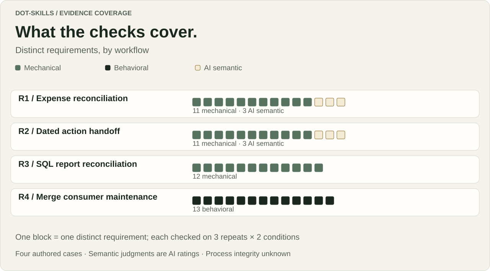

# Four workflows. Twenty-four first submissions.

A repeated offline stress study of task-specific Markdown guides, run on 2026-10-06.

[See every attempt](results/README.md) · [Inspect the tasks](cases/README.md) · [Read the methods](methods/README.md) · [Verify the saved evidence](reproduce_saved_evidence.py)

## What happened

Both conditions met every predeclared artifact requirement on all three repeats of all four synthetic cases. We did not observe a difference on the primary checks. The repeated workload still reached the scoring ceiling; that is a limitation of this comparison, not evidence of general equivalence.

<picture>
  <source media="(max-width: 600px)" srcset="../../../.github/assets/repeated-stress-runs-mobile.svg">
  
</picture>

C received the task packet without the designated package. S received the same packet plus the pinned package. C was not a skill-free baseline. All boundaries were procedural in a shared cloud filesystem.

| Workflow | Requirements per attempt | C repeats 1 / 2 / 3 | S repeats 1 / 2 / 3 | All criteria met, C / S |
|---|---:|---|---|---|
| Expense reconciliation | 14 | 14/14 · 14/14 · 14/14 | 14/14 · 14/14 · 14/14 | 3/3 · 3/3 |
| Dated action handoff | 14 | 14/14 · 14/14 · 14/14 | 14/14 · 14/14 · 14/14 | 3/3 · 3/3 |
| SQL report reconciliation | 12 | 12/12 · 12/12 · 12/12 | 12/12 · 12/12 · 12/12 | 3/3 · 3/3 |
| Merge and persistence maintenance | 13 | 13/13 · 13/13 · 13/13 | 13/13 · 13/13 · 13/13 | 3/3 · 3/3 |

The raw totals are 159 of 159 scheduled requirement instances per condition, with zero failed or not assessed. There are 53 distinct requirements and 318 scheduled instances overall. All 12 paired pass-count differences are zero; each case's three-repeat difference is also zero. The predeclared equal-case mean verified fraction is 1.0 in each condition. These are descriptive artifact counts on four authored cases, not interchangeable measures of general quality or 12 independently sampled tasks.

## What the evidence covers

<picture>
  <source media="(max-width: 600px)" srcset="../../../.github/assets/repeated-stress-coverage-mobile.svg">
  
</picture>

The 36 semantic instances received two distinct AI-assisted masked reviews each: 24 reviews and 72 initial votes, with no disagreement. R4's 78 behavioral instances came from reviewed and approved bounded executions of the unchanged frozen probe. Candidate notes do not independently verify their own test claims. [Inspect saved reports and reviews](evidence/README.md).

Artifact coverage does not verify process acceptance. Exact serving model/build, tokens, provider cost, comparable compute time, isolation and complete access histories remain unknown. No population effect, significance, time saving, cost saving or full-dot efficacy claim follows from this study.

## Example artifacts

<picture>
  <source media="(max-width: 600px)" srcset="../../../.github/assets/repeated-stress-evidence-mobile.svg">
  
</picture>

No failing criterion was observed. The predeclared fallback uses representative verified outputs, selected by case and dispatch order: [T07 expense reconciliation](artifacts/T07-R1-r3-C/reconciliation.json) and [T05 action register](artifacts/T05-R2-r3-C/action_register.json). Both are C submissions because the fixed selection rule reaches them first. They are saved-file excerpts, not screenshots or guide-benefit examples. The saved [expense totals](artifacts/T07-R1-r3-C/reconciliation.json#L590-L604) and [action totals](artifacts/T05-R2-r3-C/action_register.json#L419-L429) ground the summaries. Inspect the paired S outputs for [R1](artifacts/T08-R1-r3-S/reconciliation.json) and [R2](artifacts/T06-R2-r3-S/action_register.json); the displayed business fields match all six attempts within each case, without claiming whole-file identity. [All 45 original files remain available](artifacts/).

## Inspect or reproduce

- [24-row readable ledger](results/README.md), [per-requirement JSON](results/attempts.json), [all raw pairs](results/pairs.json), [summary](results/summary.json)
- [Frozen tasks, inputs, rubrics and scoring sources](cases/README.md), [pinned guides](guides/README.md), [source provenance](provenance/source-bindings.json)
- [Methods and operational caveats](methods/README.md): post-start bootstrap change, approximate controller timing, T24 logging disconnect and R4 flattened-input lookup
- [Deterministic graphic renderer](../../visualization/render_repeated_stress.py) and [exact visual provenance](results/visual-provenance.json); from the repository root run `python -B evaluation/visualization/render_repeated_stress.py --check`
- [Safe saved-evidence reproducer](reproduce_saved_evidence.py): run `python -I -B reproduce_saved_evidence.py` from this directory; reads and hashes only, with no candidate or model execution

## Historical context

The [earlier eight-case native-cloud study](../../results/native-cloud-2026-10-06/README.md) is preserved unchanged, including its two 40/40 primary scores and separately labeled post-hoc finding. Its files and denominators are not pooled with this study. The [original evaluation protocol](../../README.md) remains a distinct, unrun sealed design.
