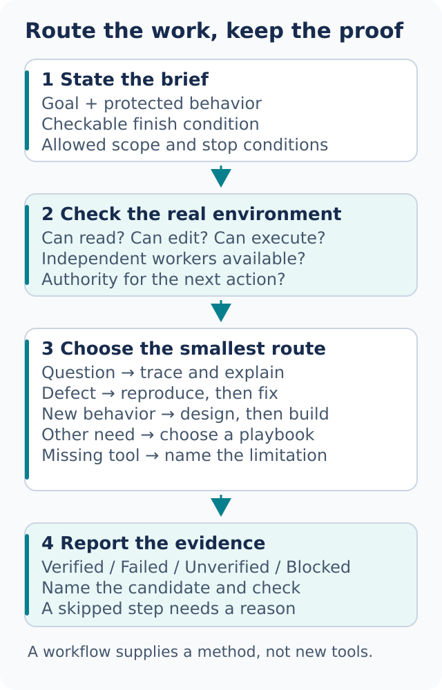

# Route work with dot-mode

[dot-mode](../../skills/dot-mode/SKILL.md) is the usual entrypoint. State the desired result and how it can be checked. The mode selects the smallest suitable playbook and brings in other skills when they are useful.



## Give the route enough information

```text
Use dot-mode. A retry produces two invoice records instead of one.
Reproduce the duplicate before changing code.
Use the synthetic invoice fixture, not production data.
Done means one record after the first request and after a retry.
```

This points to Bug fix. The route should preserve the reproduction step, identify the affected boundary, make a focused change, and rerun the same test. The synthetic-data constraint applies to every delegated worker too.

The working plan should expose the selected playbook and useful checkpoints. If the host has a native task list, it may use it; otherwise a short written checklist is enough. Record `skip: <reason>` instead of silently dropping a step. Native planning tools are not a prerequisite.

“Continue” is sufficient only when the current goal, scope, and permission boundary remain clear. It does not approve a new external action. If the assistant has lost the context, it should recover the missing brief before guessing.

## All 23 routes

Use this as a chooser, not a sequence to execute from top to bottom. Each link opens the full playbook.

| Your immediate need | Playbook | Useful finish condition |
| --- | --- | --- |
| Explain a behavior without editing | [Investigation](../../skills/dot-mode/playbooks/investigation.md) | A cited trace and named unknowns |
| Correct a reproduced defect | [Bug fix](../../skills/dot-mode/playbooks/bug-fix.md) | The original reproduction now passes |
| Add behavior | [Feature](../../skills/dot-mode/playbooks/feature.md) | New behavior works; protected behavior is unchanged |
| Improve structure | [Refactoring](../../skills/dot-mode/playbooks/refactoring.md) | Before/after behavior matches |
| Improve observed slowness | [Perf issue](../../skills/dot-mode/playbooks/perf-issue.md) | Comparable measurements explain the gain |
| Improve one measured objective repeatedly | [Hillclimb](../../skills/dot-mode/playbooks/hillclimb.md) | Frozen metric, retained gains, reported tradeoffs |
| Diagnose a live runtime symptom | [Runtime forensics](../../skills/dot-mode/playbooks/runtime-forensics.md) | A reproduced causal account with observations |
| Analyze a captured execution trace | [Trace forensics](../../skills/dot-mode/playbooks/trace-forensics.md) | Findings point to exact events and gaps |
| Test a risky idea cheaply | [Prototype](../../skills/dot-mode/playbooks/prototype.md) | The original uncertainty is answered |
| Match a visual reference | [Visual parity](../../skills/dot-mode/playbooks/visual-parity.md) | Comparable rendered views at named sizes |
| Create or change instructions | [Authoring a skill](../../skills/dot-mode/playbooks/authoring-a-skill.md) | Valid resources and a tested trigger/output contract |
| Compare workflow variants | [Eval](../../skills/dot-mode/playbooks/eval.md) | A fixed task/rubric and attributable results |
| Prepare an external review | [Opening a PR](../../skills/dot-mode/playbooks/opening-a-pr.md) | Focused diff, proof, and authorized publication |
| Resolve ongoing PR blockers | [Babysit](../../skills/dot-mode/playbooks/babysit.md) | Current merge-readiness, without automatic merge |
| Land an authorized change or stack | [Shipping](../../skills/dot-mode/playbooks/shipping.md) | Candidate-bound proof and confirmed remote state |
| Continue one bounded task while away | [Autonomous run](../../skills/dot-mode/playbooks/autonomous-run.md) | Stated predicate passes, or a resumable blocker |
| Complete independent queued changes | [Autopilot-full](../../skills/dot-mode/playbooks/autopilot-full.md) | Per-item verification and separately authorized landing |
| Prepare linked changes for later review | [Autopilot-stack](../../skills/dot-mode/playbooks/autopilot-stack.md) | Ordered stack with evidence for each link |
| Coordinate a large program | [Orchestrate](../../skills/dot-mode/playbooks/orchestrate.md) | Owned work units and reconciled integration evidence |
| Plan a multi-stage outcome | [Multi-phase plan](../../skills/dot-mode/playbooks/multi-phase-plan.md) | Dependencies, checkpoints, and executable acceptance checks |
| Resume existing work | [Session pickup](../../skills/dot-mode/playbooks/session-pickup.md) | Verified current state and an explicit resume point |
| Stop without losing work | [Pause safely](../../skills/dot-mode/playbooks/pause-safely.md) | Owned processes, changes, blockers, and next step recorded |
| Reclaim repository workspaces | [Worktree cleanup](../../skills/dot-mode/playbooks/worktree-cleanup.md) | Evidence-backed inventory and only authorized removals |

Large or ambiguous work can first use [figure-it-out](../../skills/figure-it-out/SKILL.md) to choose phases. Size alone is not a reason to run every design skill or create many agents.

## Change the task explicitly

```text
New task: explain why the cache survives logout.
Read-only investigation. Do not carry forward the parser migration plan.
```

The assistant should rematch the route, restate the new scope briefly, and leave the old work resumable. Asking a question inside an implementation run is not automatically permission to start a second implementation.

## Isolate concurrent writers

For independent implementations, ask for a branch and worktree per candidate, or disjoint files with one integration owner. A worktree is a separate checkout; it helps prevent accidental overlap but still shares repository history and other Git state. Check existing uncommitted work before creating, switching, or removing one.

```text
Build two parser approaches only if native workers are available.
Use one isolated workspace per approach and one integration owner.
If workers are unavailable, compare designs sequentially and say so.
```

The [dot-agent role](../../agents/dot-agent.md) provides a reusable worker brief. Role files do not register agents on every host. A useful brief includes the exact input revision, allowed paths, expected output, evidence, and stop conditions.

For cleanup, begin with an inventory rather than a deletion request. Being old, apparently merged, or quiet is not proof that a worktree contains no unique work. Unknown ownership and uncommitted changes require resolution; available shell access does not settle authorization.

Next: [Understand before editing](03-understand.md).
