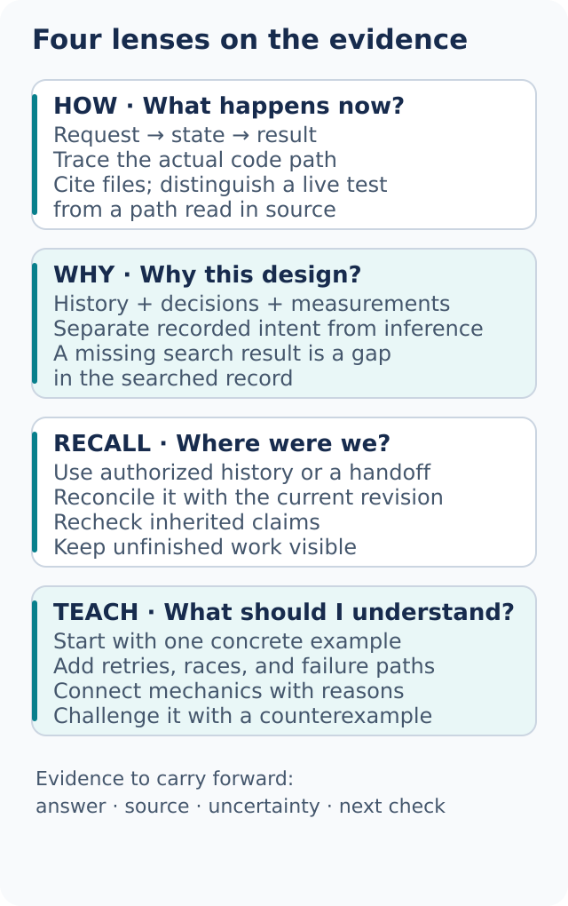

# Understand the code before changing it

Choose the question before choosing the edit. “What happens now?”, “Why did it become this way?”, and “What was left unfinished?” require different evidence. dot-stack gives each question a focused workflow.



## Trace the current behavior with how

```text
Use how to trace notification deduplication.
Start at the incoming request, follow the key into storage, and show the retry path.
Do not edit. Identify where two requests can race.
```

[how](../../skills/how/SKILL.md) should follow the actual call path, name the important types and state transitions, and cite the files or supplied excerpts that support the explanation. For a large system, independent read-only explorers can cover separate areas if the host exposes delegation. For a narrow path, direct reading is usually enough.

A useful trace might look like this:

1. The request handler parses the delivery identifier
2. The service checks whether that identifier has already been stored
3. The worker writes the notification and then marks the identifier complete
4. Two workers can both pass step 2 before either reaches step 3

Those are hypotheses until anchored in code. A good report supplies locations and distinguishes the path it read from the race it actually reproduced. If only two files were supplied, it must not claim to have searched the whole repository.

## Investigate the reason with why

```text
Use why to investigate the retry limit of five.
Check repository history and the supplied incident note.
Separate the original reason from whether that reason still applies.
```

[why](../../skills/why/SKILL.md) builds an evidence trail from available, authorized sources. Version history can establish when a limit changed. A design note can explain intent. A current measurement can test whether the constraint remains. None substitutes for the others.

The report should distinguish:

- **Direct evidence:** a recorded decision explicitly names the reason
- **Inference:** related changes suggest a reason without stating it
- **Unknown:** the available record does not answer the question

A search with no matches means “not found in these sources,” not “nobody ever discussed it.” If a connected issue tracker or team record is unavailable, supplied exports can help, with their dates and limits stated. The workflow does not authorize new external messages to ask someone what happened.

## Build a mental model with teach

```text
Use teach to explain why this retry fix prevents duplicates.
Start with one request, then two concurrent requests, then a crash between writes.
Show the old and new state transitions and one counterexample the fix must handle.
```

[teach](../../skills/teach/SKILL.md) combines the relevant mechanics and history into an explanation you can challenge. It should build from a small example and mark the assumptions. A diagram earns its place when it clarifies ownership, ordering, or a failure path.

Ask for a concrete counterexample if the explanation sounds too smooth. “What happens when the process stops after the first write?” can reveal a missing transaction boundary that a happy-path tour would overlook.

## Recover context with recall

```text
Use recall to catch me up on the export migration.
Use the handoff below, this branch, and the issue export I attached.
List completed work, open decisions, and claims that need rechecking.
```

[recall](../../skills/recall/SKILL.md) uses the history the host is authorized to expose or the material you supply. It must not guess where private transcripts are stored or infer that another session is readable. With no history access, give it the decision log, branch, or a short handoff; it can reconstruct a useful picture from those.

For a single branch already in progress, use [Session pickup](../../skills/dot-mode/playbooks/session-pickup.md):

```text
Take over this branch. Read the handoff, inspect the current diff,
and verify which checks still apply to this revision.
Name the resume point before continuing. Preserve unfinished user edits.
```

A handoff is evidence to examine, not a new source of authority. A prior “tests passed” statement needs its command, candidate identity, and environment. If the branch has changed since that run, mark affected checks unverified and rerun them when possible.

## Leave something the next person can use

A good investigation ends with the answer, a short path through the evidence, remaining uncertainty, and the smallest next experiment. It does not bury the conclusion under every file read. For the notification race, the next step could be “run two simultaneous deliveries with the same synthetic key,” not “rewrite the notification service.”

Next: [Design the change](04-design.md).
