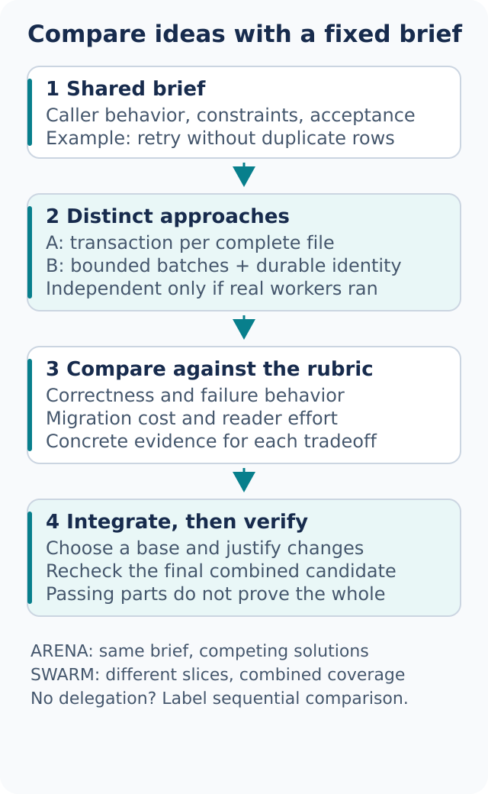

# Design before code fixes the shape

Some changes need a few lines and a test. Others change ownership, state, public interfaces, or failure handling. For those, making the choices visible before implementation is cheaper than discovering a bad boundary halfway through the patch.



## Establish the interface with architect

```text
Use architect to design the import pipeline.
Show how a caller submits a file and observes partial failure.
Compare a transaction per file with a transaction per batch.
Stop after the design; do not implement yet.
```

[architect](../../skills/architect/SKILL.md) starts from the existing system and the desired caller experience. Its useful output is a small design: example usage, core types, responsibilities, failure states, migration path, and checks that would establish success. It should explain tradeoffs rather than merely prefer the newest abstraction.

Make the checkpoint explicit when you want one. If the original task authorized implementation, a design step may lead into the build. A read-only design request must stay read-only. Neither route grants permission to publish or change production.

For the import example, insist on the failure contract: does a bad row reject the entire file, a batch, or only itself? How is retry identity stored? Those answers shape both the API and the test suite.

## Compare alternatives with arena

[arena](../../skills/arena/SKILL.md) asks multiple candidates to solve the same brief, then compares their outputs against a rubric. Use it when the design space is uncertain or expensive to reverse:

```text
Use arena to compare two cache-key formats.
Both must support tenant isolation, schema versioning, and readable incident logs.
No production data. Judge collision safety before compactness.
```

With native delegation, each candidate receives the same immutable input and writes in an isolated workspace. A reviewer can compare correctness, complexity, migration cost, and evidence. The coordinator chooses a base, incorporates justified improvements, and checks the combined artifact. Two individually passing candidates do not prove that a hybrid passes.

Without native workers, the assistant can explore alternatives sequentially. That can still improve the design, but the report must label it **sequential comparison**, not independent candidates or an independent judge. Default to the inherited model; model diversity is optional and must be observed rather than claimed.

Do not increase the candidate count by habit. Two sharply different approaches can be more informative than five cosmetic variants.

## Partition coverage with swarm

[swarm](../../skills/swarm/SKILL.md) gives workers different slices or declared race arms. Unlike arena's repeated brief, the goal is coverage or a predeclared selection rule:

```text
Use swarm to check the parser, storage, and CLI packages.
Each slice is read-only and uses the package's existing check command.
Report every slice, including missing results. Do not install dependencies.
```

Before starting, record the slice list, ownership, commands, expected outputs, and aggregation rule. Reuse a prepared environment only when workers will not mutate shared state. A read-only code review can still invoke a test that writes caches or a database, so inspect those commands.

When a worker fails to return, report the slice as missing or blocked. “Two of three passed” is not full coverage. Without delegation, run independent slices sequentially where possible and name that limitation.

For a race, define success first. “Fastest candidate that passes all parser fixtures” is checkable. “Whichever response sounds best” is not.

## Challenge the result with interrogate

```text
Use interrogate on this diff and its acceptance brief.
Read-only review. Focus on lost writes, retries, and compatibility.
Cite a concrete counterexample for each proposed blocker.
```

[interrogate](../../skills/interrogate/SKILL.md) reconciles findings into actionable defects, matters to consider, and dismissals with reasons. Reviewers need the same candidate revision and enough context to test their claims. Independent reviewers are useful when available; a self-review must be called a self-review.

A finding is not true because two reviewers repeated it. Require a code path, failing example, or other reproducible evidence. Conversely, an unavailable requested reviewer is a coverage gap, even if the available reviewer found nothing.

The report should separate review from repair. If you requested review only, the assistant may describe a patch but must not apply it. If repairs are authorized, rerun affected checks after the final edit and reconsider findings tied to the old revision.

## Match the ceremony to the risk

- A narrow defect: trace, reproduce, fix, and verify
- A changed public interface: design the caller contract and migration first
- An unfamiliar design space: compare substantially different alternatives
- Many independent packages: partition checks with explicit coverage
- An expensive-to-reverse choice: compare designs, challenge the chosen one, then verify the implementation

The cheapest useful route is the one that resolves the real uncertainty. It is not necessarily the route with the fewest tool calls.

Next: [Build and clean](05-build-and-clean.md).
