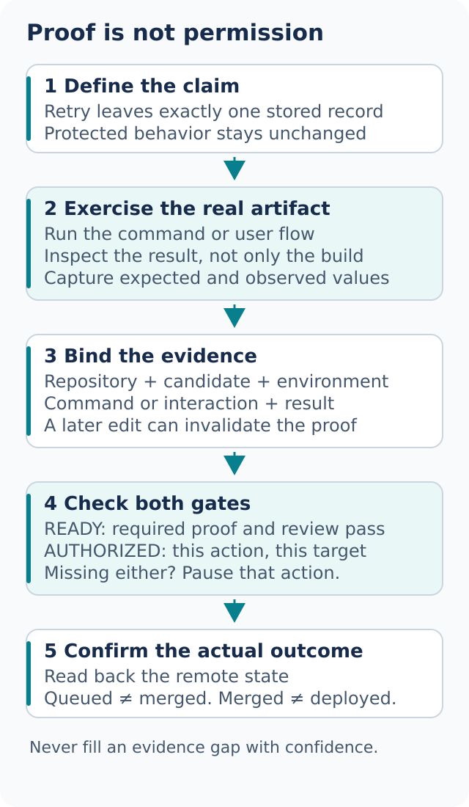

# Verify the result, then decide how to ship

A successful build establishes that the code builds. It does not establish that a user can complete the changed flow. [Prove It Works](../../skills/principle-prove-it-works/SKILL.md) asks for evidence from the artifact whose behavior matters.



## Make the finish condition observable

```text
Use dot-mode to add JSON output.
Run the real command on the sample project in both modes.
Compare default output with the saved baseline and parse the JSON.
Show the command, candidate revision, result, and remaining gaps.
```

Match proof to the change:

| Change | Strong behavioral evidence | What it does not establish alone |
| --- | --- | --- |
| CLI output | Run the command and compare literal results | A unit test of the formatter does not exercise argument parsing |
| UI workflow | Complete the changed flow in the running app | A screenshot alone may not prove persistence |
| Parser or migration | Replay representative inputs and inspect results | Compilation does not validate data meaning |
| Performance | Repeat comparable measurements before and after | One faster run may be noise |
| Storage | Write, read back, retry, and inspect invariants | A successful response may precede a failed write |

[blast-radius](../../skills/blast-radius/SKILL.md) helps identify what else depends on the safety claim. If the fix is safe only because keys are tenant-specific, prove that property with a cross-tenant example.

A useful evidence record identifies the repository or input, candidate revision or diff identity, environment, exact command or interaction, expected result, observed result, and evidence location. Bind screenshots and logs to the same candidate. After a new edit, rerun the checks it can invalidate.

## Create a project verification skill

```text
Use create-verification-skill for this app.
Reuse its existing test harness and local launch commands.
Cover login-free synthetic data first. Show one complete proof run.
```

[create-verification-skill](../../skills/create-verification-skill/SKILL.md) inspects the app and writes a reusable verification workflow in an agreed project-local skill location. Useful sections include:

- **Launch:** the actual startup command, fixture, ports, and readiness signal
- **Doctor:** prerequisites and checks that distinguish a broken environment from a product failure
- **Drive:** steps through the real user or API interface, with literal expected outcomes
- **Evidence:** what to capture and how to bind it to the candidate
- **Cleanup:** how to stop owned processes and remove only the run's temporary data

A feature map connects each behavior to its input, exercise path, observable result, and evidence. Start with the [worked feature-map example](../../skills/create-verification-skill/references/feature-map-example/README.md), then adapt it to the repository. Do not copy imaginary commands into a supposedly executable guide.

Before treating the skill as proven, require one launch, readiness check, exercised feature, captured result, and cleanup. A browser interface is one possible capability; an existing harness, HTTP API, or terminal interface may be appropriate. Missing credentials, dependencies, or control tools leave specific steps blocked or unverified. Generated instructions alone are not a proof run.

## Keep the verification workflow current

[maintain-verification-skill](../../skills/maintain-verification-skill/SKILL.md) compares documented behavior with source and live results where possible. It should report whether the workflow is current, needs corrections, or is blocked. Parallel source readers can help with coverage if available; their findings still need reconciliation against the final app.

```text
Audit the verification skill against the current app.
Change only its agreed directory. Do not modify product behavior to make checks pass.
List any real regressions separately and stop before external publication.
```

If a documented expectation is still correct but the app violates it, report a product regression. Weakening the assertion would conceal the defect. If a check cannot run, do not label the audit clean merely because the Markdown looks valid.

## Prepare and open a pull request

[Opening a PR](../../skills/dot-mode/playbooks/opening-a-pr.md) organizes the change for review: inspect the branch, preserve existing work, create focused commits when authorized, and draft a description with behavior, evidence, and gaps.

```text
Prepare this change for review with focused commits and an evidence summary.
Show me the proposed PR title and description. Do not push or create the PR yet.
```

That request stops at preparation. A separate explicit request can authorize pushing to the named repository and opening the PR. The available host tool and actual user authorization govern the action. A skill name or green check never grants publication permission. Confirm the remote result before reporting a PR as created.

## Watch blockers with Babysit

[Babysit](../../skills/dot-mode/playbooks/babysit.md) handles current conflicts, review findings, and CI within the approved scope. For a snapshot, say “check the current status.” For continued work, specify the target, allowed repairs and pushes, and stopping condition.

```text
Check this PR's current head, required checks, and unresolved reviews.
Return a status snapshot only; make no remote changes.
```

A continuing run must distinguish observation from mutation. Reading a review thread does not authorize replying, resolving it, or pushing a change. Triage comments against evidence; do not accept every suggestion or silently dismiss real defects. Missing remote access means current status is unknown.

Babysit stops at merge-readiness. A queued check, pending review, or requested merge is not a confirmed outcome. A watcher can observe while its process or session lives; it is not proof of a durable future wake.

## Land a verified stack with Shipping

[Shipping](../../skills/dot-mode/playbooks/shipping.md) requires proof for the exact candidate and authorization for the actual merge target. For a stack, work from the bottom and stop at the first unverified or blocked link. An upper PR cannot skip a dependency beneath it.

Fresh independent review is a separate requirement where the shipping contract calls for it. If the host cannot supply that reviewer, report the missing gate and request an appropriate review; a self-check cannot silently replace it. After a rebase or new push, reconsider which proof remains valid.

Readiness and authorization answer different questions:

- **Ready?** The candidate meets the required behavioral, review, and remote-state conditions
- **Authorized?** The user has approved this external action on this target, within host rules

Both are needed. After acting, read back the remote state and report the observed merge result and any remaining links. Do not call a merge-queue entry a completed merge or a merged branch a deployed release.

Next: [Work while you are away](07-overnight.md).
