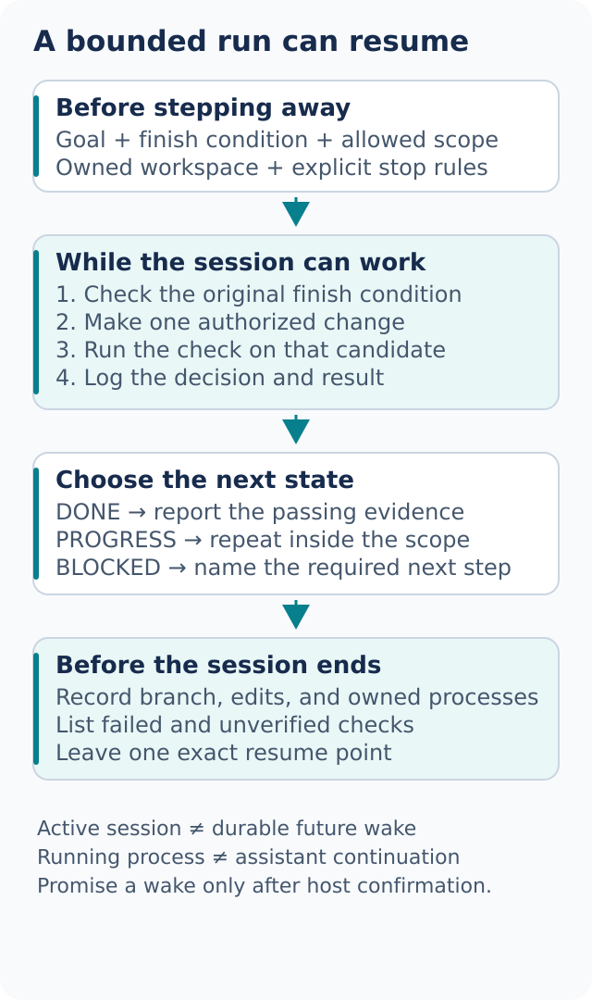

# Work while you are away

A long run needs a bounded goal, visible evidence, and a safe place to stop. It also needs a host that can actually keep working. dot-stack can structure the run; it cannot make a closed conversation resume or turn a local process into a durable agent.



## Write the unattended-work contract

```text
Use dot-mode to migrate callers to the new parser in an isolated worktree.
Done means no old callers, all parser fixtures pass, and the unused old API is removed.
You may edit the agreed source and tests and create local commits.
Do not push, merge, deploy, or change credentials.
Keep a decision log. Stop if the scope needs to expand or a required action needs approval.
Before the session ends, leave a resumable handoff with current evidence.
```

Each part prevents a different failure:

- The goal says what to change
- The finish condition gives the run something that can pass or fail
- Isolation reduces conflict with your other work
- Allowed actions establish the actual local boundary
- Exclusions remove ambiguity around consequential next steps
- Stop conditions prevent the assistant from reinterpreting the goal to stay busy
- The handoff survives a session that cannot keep running

Being away is not blanket permission. Required approvals remain required. The assistant should continue independent authorized work while one action is blocked, then report the exact dependent blocker.

## Check the execution mode before relying on it

There are three materially different situations:

1. **An active session:** the assistant can keep working while the host keeps that session alive
2. **An owned running process:** a test or watcher may continue, but it cannot make an ended assistant conversation reason or respond
3. **A verified durable schedule or event subscription:** the host has saved a supported future trigger, with authorized scope and a confirmed destination

Do not collapse these into “it will run all night.” If there is no durable mechanism, use session-bound work and a resumable handoff. If a durable trigger is requested, verify its actual creation before promising a future wake. Installing a workflow, writing a schedule-shaped file, or starting a watchdog is not enough.

[Autonomous run](../../skills/dot-mode/playbooks/autonomous-run.md) and [figure-it-out](../../skills/figure-it-out/SKILL.md) can phase the task. A reasonable loop is: check the predicate, make one justified change, run its proof, record the result, then choose the next step. Failed attempts should be isolated or reverted only within the run's owned changes. Never reset unrelated user work to make the tree look clean.

A plateau calls for a new hypothesis or a blocker report. It does not justify weakening the finish condition, unlimited compute, or extending the authorized scope.

## Leave a decision trail

[show-me-your-work](../../skills/show-me-your-work/SKILL.md) records consequential choices with their reasons and evidence. Use a project-local run directory, such as an agreed directory under `.dot-stack/state/`, rather than a read-only plugin cache. Keep transient logs out of commits unless sharing them is part of the task.

Useful entries include time, phase, decision, rationale, candidate identity, evidence pointer, and result. Record “rejected batch-level transaction because the retry fixture duplicated one row” rather than “worked on transactions.” Keep secrets and unnecessary personal data out of logs.

When you return, ask:

```text
Use show-me-your-work to summarize this run.
Lead with the finish condition, current candidate, and failed or unverified checks.
Then show the decisions I should review and the exact resume point.
```

If a fresh reviewer actually inspected the accessible trail, the summary may say so. Otherwise label it a self-audit. The workflow cannot assume access to a private transcript or claim a different model reviewed it.

## Queues and event-driven work

For several tasks, choose the shape deliberately:

- [Autopilot-full](../../skills/dot-mode/playbooks/autopilot-full.md) assigns independent items clear ownership, verification, and a landing path. Its name does not authorize merges; obtain scope for each target or a bounded queue first
- [Autopilot-stack](../../skills/dot-mode/playbooks/autopilot-stack.md) prepares linked changes for later review, with evidence attached to each candidate and no implicit shipping
- [Orchestrate](../../skills/dot-mode/playbooks/orchestrate.md) coordinates a program with dependent units, owners, and integration checkpoints. Without native workers, reduce it to an honest sequential plan rather than simulating a fleet
- [Multi-phase plan](../../skills/dot-mode/playbooks/multi-phase-plan.md) is useful when the work needs checkpoints but not a standing coordinator

The [Benny automation recipes](../../automations/benny/README.md) cover [setup](../../automations/benny/skills/setup-benny/SKILL.md), [issue triage](../../automations/benny/skills/triage-issue-reports/SKILL.md), and [reproduction and repair](../../automations/benny/skills/reproduce-and-fix-issues/SKILL.md). They are dormant until specifically configured and enabled through actual supported host capabilities. Validate an authorized read first. Define the event, source, allowed information, recipients, actions, and stop conditions. External posts, persistent credentials, and live triggers have their own permission boundaries.

If no scheduler or connector exists, the result can be a reviewed setup draft and test fixtures. It cannot be a claimed running automation.

## Stop cleanly and resume accurately

Use [Pause safely](../../skills/dot-mode/playbooks/pause-safely.md) to capture the current branch or worktree, owned processes, uncommitted edits, completed checks, remaining risks, and next action. Stop only processes that belong to this run and preserve recoverable work.

Later, [Session pickup](../../skills/dot-mode/playbooks/session-pickup.md) checks that the handoff still matches the repository. Old passing evidence becomes unverified where the candidate or environment changed. A good pause is a useful engineering result, not a fabricated success.

Next: [Steer with principles](08-principles.md).
