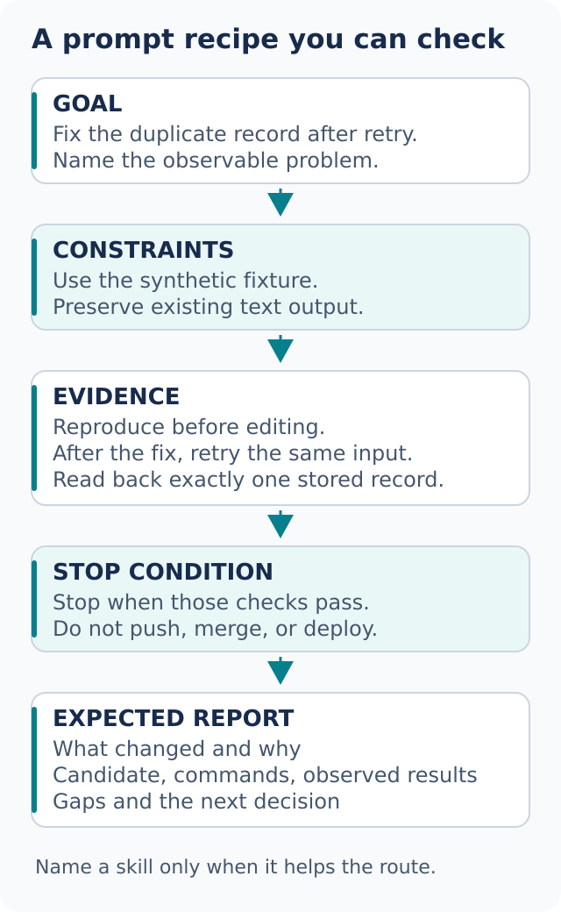

# Recipes and pitfalls

These briefs are starting points. Replace the paths and finish conditions with your own. Load the named skills through your host's supported interface; ordinary text below is not a promise of a universal command syntax.



## Understand an unfamiliar subsystem

```text
Use how to trace initialization from process start to the first request.
Then use why on the recent change that moved configuration loading.
Read-only. Cite the current path and separate recorded intent from inference.
```

Expect a runtime map, evidence locations, and a short list of unresolved questions. With only supplied files, expect explicit coverage limits.

## Get a second opinion on a design

```text
Use arena to compare our batch-import design with a streaming alternative.
Both must preserve ordering and recover from a failed batch without duplicates.
Use independent candidates if available; otherwise label the comparison sequential.
```

Ask for tradeoffs against a fixed rubric, then verify the integrated choice. Do not confuse multiple headings with multiple independent reviewers.

## Cover independent packages

```text
Use swarm to check parser, storage, and CLI against their existing test commands.
One slice per package, isolated writable outputs, no dependency installation.
Report every slice and any missing worker result.
```

A useful summary distinguishes passed checks, observed defects, blocked commands, and unverified coverage. If no workers are available, sequential execution is an honest fallback.

## Review a branch skeptically

```text
Use interrogate on the current branch at the recorded head.
Do not edit. Focus on lost data, changed behavior, and missing rollback assumptions.
Require an example or code path for each finding; explain dismissals.
```

Review findings are proposals backed by evidence. They are not instructions from a third party that authorize changes or external replies.

## Fix through a failing behavioral test

```text
Use dot-mode to reproduce the duplicate export write.
If the existing harness can express it, use tdd.
Assert one stored record after retry, fix the cause, and rerun nearby cases.
Do not publish the branch.
```

The failure must be the defect you intended to reproduce. A test that fails because setup is broken is not the red half of a red-green demonstration.

## Investigate a trace before changing code

```text
Use the Trace forensics playbook on this captured request trace.
Identify the first unexpected event, competing explanations, and missing evidence.
Do not infer current production status from an old capture.
```

For a live symptom rather than a captured trace, use [Runtime forensics](../../skills/dot-mode/playbooks/runtime-forensics.md). Both routes should separate observed events from a causal hypothesis.

## Match a visual reference

```text
Use the Visual parity playbook for this local settings page and reference image.
Compare the same viewport and state at desktop and mobile sizes.
Use synthetic content and report any interaction you could not exercise.
```

Rendered visual evidence requires an actual browser or render harness. Source review alone cannot establish layout parity. A screenshot comparison does not establish that the Save button persists data.

## Explore a product idea without overbuilding

```text
Use the Prototype playbook to test whether users can identify a failed import.
Build only the status view with synthetic data on localhost.
Done means the error, affected rows, and next action are clear in the test scenario.
```

If you want a local control surface for an existing workflow, [make-bot-ui](../../skills/make-bot-ui/SKILL.md) starts with a bounded localhost interface and synthetic events. Public exposure, live event delivery, and persistent authentication are separate decisions. Do not place secrets in browser code.

## Leave a bounded unattended task

```text
Continue the agreed parser migration while this session is available.
You may edit the agreed files and run local tests; no push, merge, or deployment.
Keep the original finish condition. If blocked or the session ends, leave a handoff.
```

[The unattended-work chapter](07-overnight.md) explains capability checks, decision logs, queues, and durable trigger limits. A duration can bound effort; it cannot replace an acceptance condition.

## Redirect a drifting run

```text
The task is reproduction only. Stop implementation and show the failing case.
```

```text
Apply Prove It Works. Show the stored result after retry, not only the build log.
```

```text
Use bro to explain the last result in plain language.
Keep the unverified checks and the decision I need to make.
```

A short correction works when it identifies the wrong decision. If you are switching tasks, say “new task” and provide the new scope.

## Pitfalls worth avoiding

- **Vague success:** “make it better” has no stable test. Name an observable behavior, metric, or reviewable artifact
- **Invented capabilities:** a skill does not create a shell, worker, browser, model choice, history source, or scheduler. State the gap and use a truthful fallback
- **Missing evidence disguised as success:** compilation, fixture checks, and live behavior are different claims. Label each separately
- **Readiness treated as permission:** passing checks does not authorize a push, external comment, merge, deployment, account change, or destructive cleanup
- **Shared writers:** several agents editing one file can destroy each other's assumptions. Isolate work and name an integration owner
- **Arena used for coverage:** arena compares solutions to one brief; swarm partitions coverage or declared race arms
- **Stale proof:** a passing run for an earlier revision does not automatically validate a later one. Bind evidence to the actual candidate
- **Blindly accepting review:** demand a concrete defect and read the reason for dismissals too
- **Overreading history:** a missing search result is a coverage limit. Do not scrape guessed private transcript locations
- **Instruction edits mixed into unrelated changes:** keep workflow changes reviewable and test the missing-capability and permission cases
- **False durability:** a running process is not a saved future assistant wake. Verify the actual mechanism or leave resumable state
- **Safety through deletion alone:** cleanup requires ownership and recoverability evidence. Preserve user work and required legal notices

For the complete route chooser, return to [all 23 playbooks](02-dot-mode.md#all-23-routes). For the complete skill map, use the [guide index](README.md#the-complete-skill-map).
