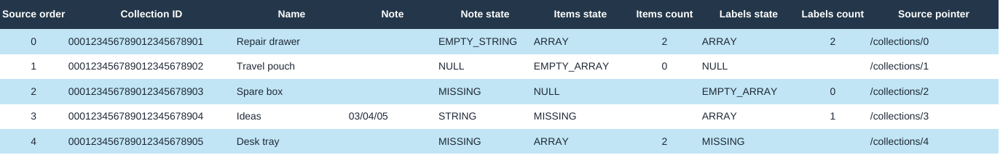
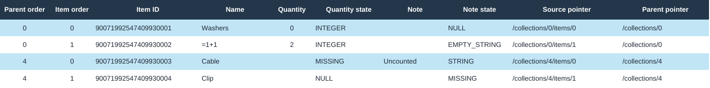

# A Pocket Shelf export becomes a workbook

The original fictional [source JSON](fixture/source.json) is a small household-organizing export. It has five collections, four item occurrences and three label occurrences. Collection 0 has both two items and two labels. Two labels are identical and both remain present.

Open the [workbook](outputs/example/nested-export.xlsx). Filter `Items` on `Parent order = 0` to see its two items, then filter `Labels` on the same parent to see two label occurrences. No join expands the two sibling arrays into four rows. Filter `Quantity state` to distinguish the numeric zero from an explicit null and an omitted quantity.

The collection IDs have 24 digits and leading zeros. The 20-digit item IDs exceed ordinary numeric precision. They are stored as strings. The item named `=1+1` is literal text; it has no formula. The note `03/04/05` is unchanged text, with no date interpretation. The supplied export timestamp appears as a quoted JSON string so its offset and spelling survive without date inference.

## What to inspect

- [Mapping and reconciliation](outputs/example/report.md): sheet roles, state semantics, exact counts and boundaries
- [Saved-file reconciliation](outputs/example/reconciliation.json): source and workbook identities and checked results
- [Native readback](outputs/example/native-readback.json): checks after a disposable LibreOffice save
- [Negative controls](outputs/example/controls.json): inputs held and workbook corruptions detected
- [Verification record](verification.md): actual versions, consumer checks and limits





## Reproduce without installing anything

Requirements are Python 3.12+, Node.js, the already-installed `@oai/artifact-tool` library, LibreOffice with `soffice`, and Poppler's `pdftoppm`. No account, network access, package installation or live service is required. Run from this example's directory, passing the location of an existing Node module tree:

```sh
python3 -B scripts/reproduce.py \
  --output outputs/new-run \
  --node-modules path/to/existing/node_modules
```

The module path is an explicit local dependency location, not a download instruction. Use `--node` if that module tree requires a particular installed Node executable. An optional `--work-dir` chooses where disposable runtime files are placed. The output directory must not already exist.

The runner strictly parses the fixture, authors the XLSX, checks its saved ZIP/XML, saves a disposable copy through LibreOffice, checks that copy, runs the corruption controls, and renders all five native sheets to PNGs. Inspect those images visually before delivery. It writes fresh digests; XLSX serialization metadata can change the binary digest across runs even when the checked content is identical. Recheck the included workbook without authoring another one:

```sh
python3 -B scripts/check.py fixture/source.json outputs/example/nested-export.xlsx
```

## Adapter limits

This is a `pocket-shelf/1` adapter, not a universal JSON converter. It accepts 1–100 collections, at most 300 total item/label occurrences and 64 KiB of UTF-8 JSON. IDs, names and labels are strings; quantity is an integer, null or absent. Optional note is string, null or absent. Items and labels are arrays, null or absent. Unknown fields, decimals, scientific numeric notation, negative zero, more than 15 numeric digits, non-finite values and unsupported XML/cell text are held before authoring.

For the installed writer, ISO-style date/timestamp strings in the direct review fields and strings beginning with an apostrophe followed by `=` are also held. A real adapter must choose and verify an explicit encoded-text mapping for those values. The known root timestamp uses that mapping already: a JSON string token in `Read me` and `Source paths`. Ordinary source text is never silently changed to a date or escape-prefixed value.

Blank-looking values are interpreted only with their state. `Source paths` holds 51 actual source nodes and six separate observations about absent schema fields. Reconstructing from the saved scalar tokens, states and ordered parent links restores the source tree's values, types, field presence and order. It does not reproduce whitespace or the original JSON escape spelling; the unchanged source retains those bytes.
