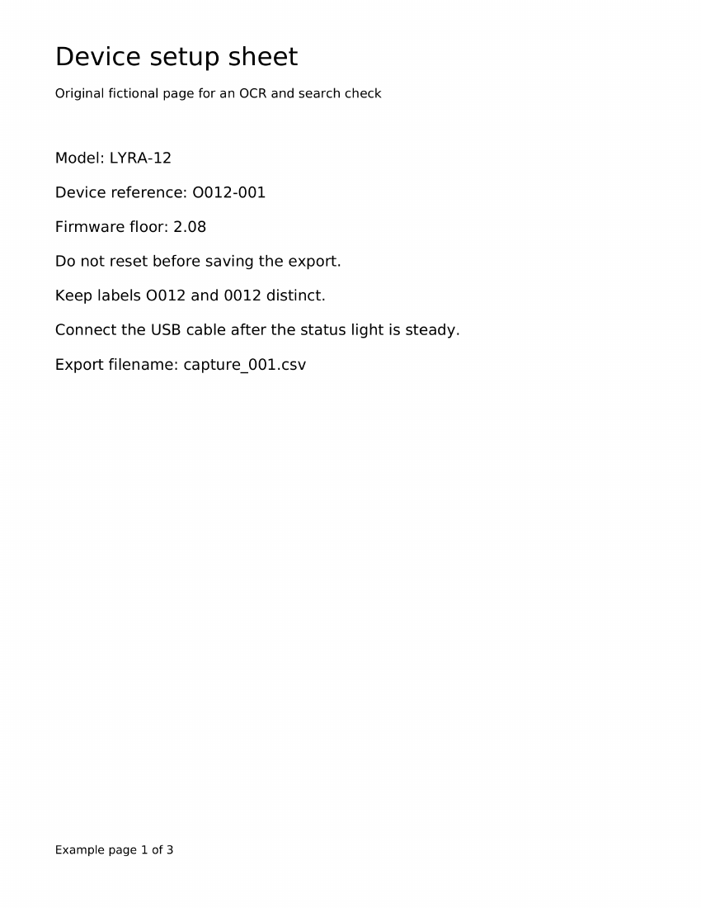

# A searchable copy that survived review

This is an original fictional device sheet, not a real product manual or a private scan. It contains no advice for operating an actual device. Its short, deliberately confusable text makes the difference between successful OCR and reviewed OCR visible.

- [Original PDF](source-mixed.pdf): three Letter pages in their original order. Page 1 is image-only, page 2 contains native selectable text and page 3 is intentionally blank.
- [Reviewed searchable PDF](searchable-reviewed.pdf): the same visible pages with a corrected invisible text layer on page 1.
- [Source and correction record](source-review-record.json): original authored wording, actual raw OCR lines, three supported corrections, versions and file digests.
- [Machine verification](verification.json): an actual run of the included checker, with its precise scope and limitations.



## What actually happened

The input was created for this example. The first page was rendered from its original authored text at 250 DPI and embedded as an image. That original authored text and the rendered page were available during review. A real OCRmyPDF 16.7.0+dfsg1 / Tesseract 5.5.0 pass produced a draft OCR PDF. Tesseract hOCR recorded the line locations and raw recognition. The OCR succeeded, but review found three lines requiring correction:

| Actual raw OCR | Reviewed text | Evidence |
| --- | --- | --- |
| `Device reference: 0012-001` | `Device reference: O012-001` | Original authored wording, checked beside the rendered source |
| `Keep labels 0012 and 0012 distinct.` | `Keep labels O012 and 0012 distinct.` | The source deliberately distinguishes the letter O and digit zero |
| `Export filename: capture _001.csv` | `Export filename: capture_001.csv` | The authored filename has no inserted space |

The review did not globally change `0012` into `O012`. The second identifier in the sentence really is `0012`. The negation in `Do not reset before saving the export.` and the decimal in `Firmware floor: 2.08` were retained unchanged.

A corrected invisible layer was merged onto the original image-only page. It was not stacked over the erroneous draft layer. The native second page and the blank third page were preserved. The two published PDFs are exact copies of the original example artifacts; neither was rebuilt for packaging. Intermediate OCR PDFs, hOCR and page images are not required to use the delivered result and are not included.

## What the evidence establishes

The recorded checker run reopens both supplied PDFs and confirms their SHA-256 digests. It compares all three page renders at 100 DPI, effective page boxes and rotations, decoded embedded image samples and image placement. It checks the native second page's content stream and text, the blank page, and full line-by-line extraction of the reviewed page with pypdf and PyMuPDF. Every authored page-1 line appears exactly once in the expected order.

PyMuPDF search finds the corrected reference, distinct-label sentence, filename, unchanged negation and firmware value once on page 1, and `native-page-B` once on page 2. Search rectangles lie inside the expected page and the full corrected lines remain near their source image regions. The original image-only first page has none of those searchable strings. Search for the three superseded readings returns no hit in the reviewed first page. These are measured results for these short single-line phrases, not a rule that one rectangle always means one match.

The render comparison shows pixel equality at the tested 100 DPI, while the decoded image comparison separately checks preservation of the scan pixels. The PDFs themselves necessarily have different bytes because one contains the additional reviewed text layer. Successful checks do not certify other PDFs, every possible viewer, accessibility or archival compliance.

Viewer UI search, clipboard copying, screen-reader behavior, tagged reading order, signed/protected files, forms, annotations, unusual layouts, rotated/cropped pages and other languages were not exercised by this fixture. All three pages are simple, unsigned, unencrypted, untagged Letter pages. A real document needs checks matching its contents and intended use.

A separate guide-only fictional rehearsal considered ambiguous screenshot text on a mixed page and an old OCR layer that could not safely be removed. It planned preservation of native content and the blank page, identified a source-supported decimal correction, and kept the unresolvable regions at draft status. That review clarified that an uncertain critical identifier must be omitted or explicitly marked uncertain in the searchable/copyable layer itself; a warning only in a separate note is insufficient. This was an instruction/evidence review, not another PDF conversion or viewer test.

## Run the check again

The checker requires Python 3, pypdf, PyMuPDF, Pillow and Poppler's `pdftoppm` and `pdftotext` on PATH. Install missing dependencies through an authorized package source. From this skill folder, run:

```bash
python scripts/check_example.py
```

It prints a JSON report and exits nonzero if a measured invariant fails. It reads only the bundled, hash-pinned example files and uses a temporary folder for render images; it does not edit either PDF or make network requests. To keep a new report, redirect stdout to a new local filename. The supplied `verification.json` is the recorded run, not an automatically refreshed claim. The script is a narrow example checker, not a general PDF repair or security-validation tool.
